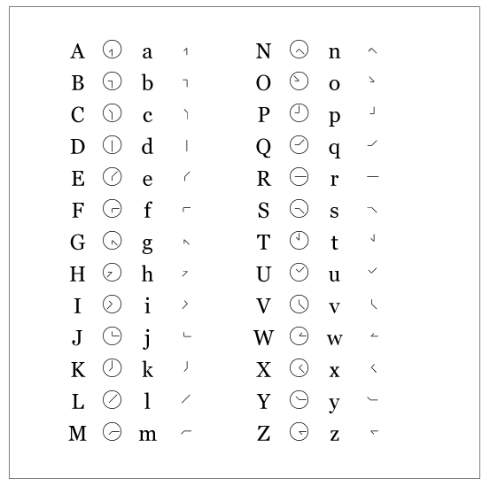
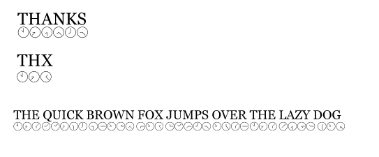

# YUUClockSemaphore font

Clock Semaphore font is a flag semaphore with clock hands.

The right hand flag is a short hour hand of the clock face.  
The left hand flag is a long minute hand of the clock face.  

My idea is a communication with connected watch using this clock semaphore.  
So no flat panel, only traditional clock hands!!  

Like Telex style **THX** rather than **THANKS**.
